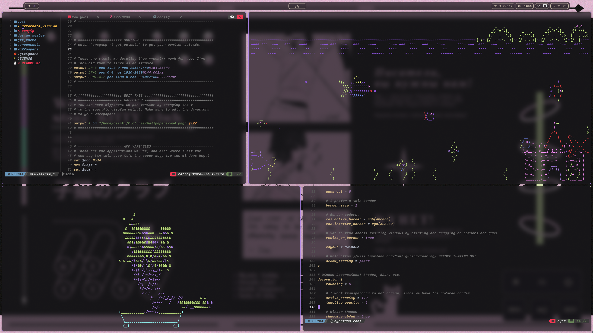

# Retro-Futuristic Linux Rice

If you enjoy the content & art I create, feel entirely free to give a tip on kofi!

---

 

Screenshot - Main Rice

 

Screenshot 2 - Main Rice

 

Screenshot 3 - Alternate Version

 

Screenshot 4 - Alternate Version

diinki-retrofuture is a rice that revolves around [this](https://youtu.be/z9z1QcYQeJk) youtube
video, where I teach how to make this exact rice from scratch. Naturally, the github version
has cleaner config files and more comments, I bid you a read of the config files and code; you will need to
edit some lines yourself regardless.

This project also includes a GTK3/4 theme which matches the aesthetic.

## 📌 Installation Steps

Feel free to watch [this part of my video](https://youtu.be/z9z1QcYQeJk) where I demonstrate how to install this rice.

**I assume you use arch / arch-based, but the steps should be similar regardless.**

1. `Installation`
   - Run `sudo pacman -S sway wofi waybar nemo nautilus kitty dconf dconf-editor` in your terminal.
   - Run `yay eww` in your terminal (you will need to install yay).
   - Install the [Maple Mono font](https://github.com/subframe7536/Maple-font), as this font is used a lot in this Linux rice. Move the font-file to `/usr/share/fonts`, then run `fc-cache -f -v` to update the fonts.
   - Run `git clone https://github.com/diinki/diinki-retrofuture` to clone this repo, or install it from the Releases section.
2. `Configuration & Setup`
   - Copy all folders in the `diinki-retrofuture/config` directory to your local user `.config` directory
     (`~/.config`). Skip the `hypr` folder if you don't also want the hyprland config files.
   - Copy the `diinki-retro-dark` folder in `diinki-retrofuture/gtk_theme` to your local `.themes` directory (`~/.themes`), you may need to create this directory manually.
   - Use a text editor to edit the sway config file in `~/.config/sway/config`. You need to edit the config
     to setup your wallpaper and monitor settings. I've commented the file with the steps.
   - Enter `dconf-editor` in your terminal to open up the dconf gui program, search "gtk-theme", and set the theme value to `diinki-retro-dark`. You may also use dconf to set your icon theme and cursor theme to ones of your liking.
3. `Creative Liberty`

   - I have the config files in a concise and descriptive manner, I recommend reading them and
     editing them as you see fit; you may want to add or change things, such as the keybinds for sway, or
     the fonts used.
   - Feel free to continue reading this document for more details on the design & softwares used.

   > Note: I have also included a Hyprland Config Directory (config/hypr), in case you want to use this rice with Hyprland,
   > it works by default and the only thing you need to do is drag the hypr folder into your ~/.config directory.

### ⌨️ Keyboard bindings

All key-binds can be find in the sway config file, simply refer to those and edit them if you'd like.
The most important default bindings are:

- `mod` = the super key, (the windows key, as some people refer to it as). You can re-bind mod to something else if you wish.

- `mod` + `Enter` = launch terminal.
- `mod` + `D` = launch application launcher.
- `mod` + `[any number, 1-9]` = switch focus to the workspace equivalent to the number.
- `mod` + `Shift` + ` [any number, 1-9]` = move the focused window to the workspace equivalent to the number.
- `mod` + `Shift` + ` Space` = toggle floating mode for the focused window.
- `mod` + `Shift` + ` C` = restart eww and all other things such as waybar and eww.
- `mod` + ` Q` = Exit/Kill the focused window.
- `mod` + `F` = toggle full-screen mode for the focused window.
- `mod` + `Right Mouse Button` = re-size a window
- `mod` + `Left Mouse Button` = move a window

---

### 💾 Toolkit & Software

This rice uses the following tools and softwares:

- `sway` (The window manager)
- `hyprland` (The alternate window manager)
- `wofi` (Application Launcher)
- `waybar` (Taskbar/Infobar)
- `dconf` & `dconf-editor` (Used to edit gtk themes and cursors, and default softwares used)
- `nemo` or `nautilus` (File explorer).
- `kitty` (The terminal Emulator)
- `themix-oomix` (Used to create the non GTK4 themes.)
- `network-manager-applet` (Used for tray and other nm things, probably installed with your OS by default.)
- `eww` (Widgets)

> ℹ️ In the guide I used EndeavorOS with Gnome as a basis and showed how to switch from gnome
> to sway. In order to boot between swaygnome I decided to demonstrate the `ly` login
> manager.

- `ly` Login/Display manager that's used.

### 🖌️ Design Language

This Linux rice is simple in essence, no massive and complicated config files and designs;
that being said there's still thought put into the design of each element in order to achieve a **Retro Futuristic Aesthetic**,
this includes the design for the wallpapers included with this rice.

Design system descriptions can be found in the `design_system` directory of this repository.

### 🎨 Color Palette

The main color palette used widely for this rice in both the GTK themes and other components are:

`Core:`

-  Accent: `#AC82E9`
-  Accent Deep: `#8F56E1`
-  Dark: `#141216`
-  Lighter Dark `#27232b`
-  Foreground: `#d8cab8`
-  Complementary Accent: `#c4e881`

`Additional:`

-  Warning: `#fcb167`
-  Danger: `#fc4649`
-  Yellow: `#f3fc7b`
-  Green: `#c4e881`
-  Blue: `#7b91fc`
-  Cyan: `#92fcfa`
-  Magenta: `#fc92fc`

### 🌆 Wallpapers:

Wallpapers for this rice can be found in the `wallpapers` directory of this repo.

You may use `sway-fx` instead of `sway`, which is a fork of `sway` with additional features
such as shadows, rounded edges, and blur; `hyprland` also has those features which baseline sway
doesn't posses.

All Wallpapers included in this repo are bespoke for the rice, made by me. Additional elements may
have been cut-out / traced from images, I'll include credit if I find the reference sources.

### 🖋️ Fonts:

I mainly use the Maple Mono font in this rice, it's a good font and so I recommend installing it.
You can edit the font by editing the config files.

For other unicode symbols, you will likely need to download `nerd-fonts`.

You can install the font directly from github, I recommend keeping it relatively up-to-date. Move the font
files to your system `/usr/share/fonts` directory, then update the font cache by running `fc-cache -f -v`

### GTK & Icon Theme:

I recommend using the included GTK theme, however for the icon theme you may pick whichever you like. The
GTK theme is likely what would change most if I ever update this rice.

## Alternate Version:

The `alternate_version` directory contains alternate configs for alternate designs of this rice.
it's an alternate style that incorporates blur and corner radii into the design, yet maintains
the same colors.

**Note**: Using the alternate version will require either using the alternate
`hypr` config with `hyprland`, or installing `swayfx` so you can set-up blur; the alternate
versions wont look good without blur; which default sway doesn't support.

### 📜 License

This project is licensed under the MIT permissive license.
